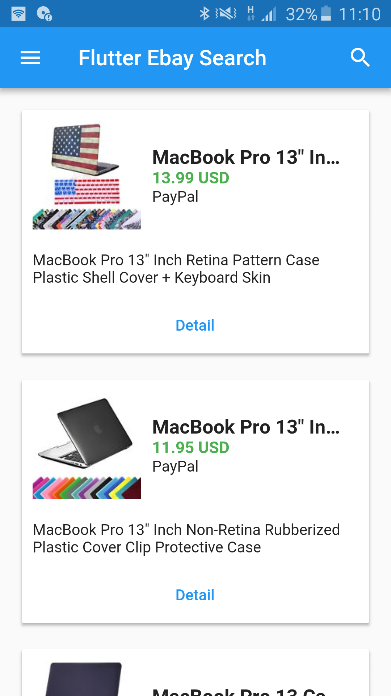
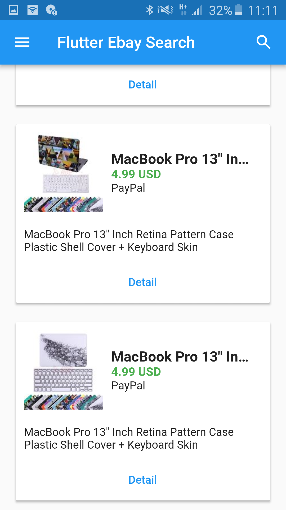
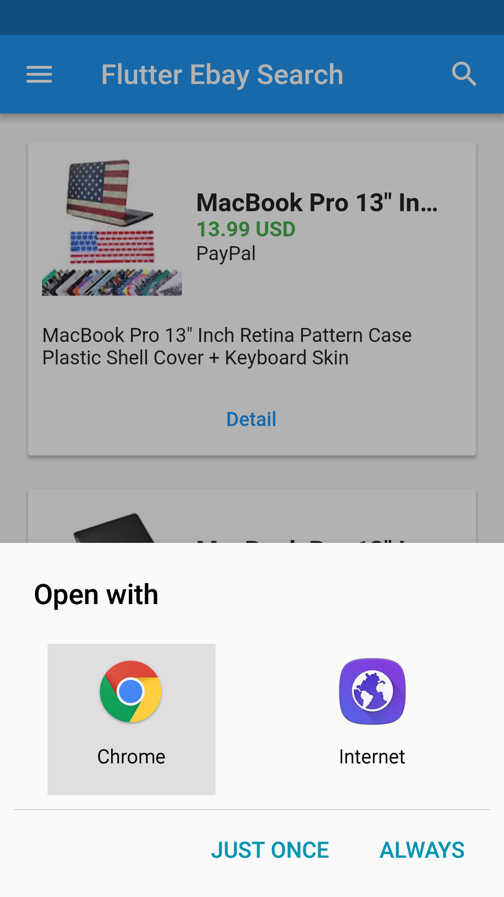
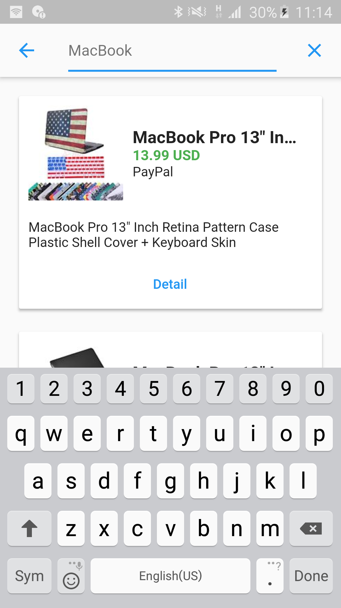

# flutter_ebay_search

A new Flutter project.

## Getting Started

For help getting started with Flutter, view our online
[documentation](http://flutter.io/).

Register in [Ebay developer](https://developer.ebay.com/signin)
and Copy App ID (Client ID) and Reemplace in MyAppID

  
  

  
  

